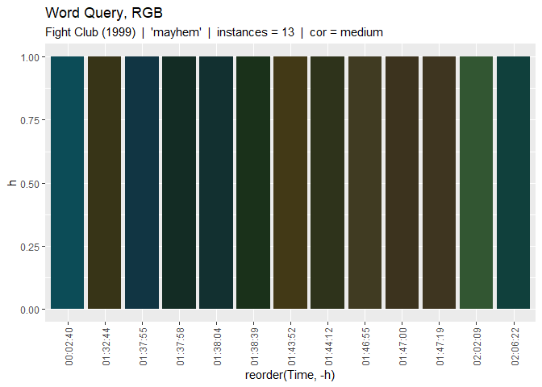

Semantic Colour Analysis
================

## List of Functions:

  - top\_RGB\_graph: Top Words, Analayze RGB, Plot Frequency

  - top\_RGB\_data: Top Words, Analayze RGB, Plot Dataframe

  - word\_RGB\_graph: Query Word, Analyze RGB, Plot Bar Graph

  - word\_RGB\_data: Query Word, Analyze RGB, Plot Dataframe

  - word\_lum\_graph: Query Word, Analyze Lum, Plot Bar Graph

  - word\_lum\_data: Query Word, Analyze Lum, Plot Dataframe

  - word\_lum\_RGB\_scatter\_smooth: Query Word, Analyze Lum, Plot
    Scatter w Smooth

  - word\_lum\_RGB\_scatter\_data: Query Word, Analyze Lum, Plot
    Dataframe

  - word\_temp\_RGB\_scatter: Query Word, Analyze Temp, Plot Scatter

  - word\_temp\_RGB\_scatter\_smooth: Query Word, Analyze Temp, Plot
    Scatter w Smooth

  - word\_temp\_RGB\_scatter\_data: Query Word, Analyze Temp, Plot
    Dataframe

Clear

``` r
rm(list = ls())
```

Create Library

``` r
library(devtools)

#install_github("detsutut/chroma", subdir="chromaR")

library(subtools) #subtitles manipulation
library(chromaR) #chromatic package
library(tidytext) 
library(chroma)
library(hms)
library(tidyverse)
library(ggplot2)
library(data.table)
library(dplyr)
library(stringr)
library(reshape2)
```

``` r
library(tidyverse)
library(magrittr)
library(readtext)
library(stringi)
library(quanteda)
library(SnowballC)
library(stopwords)
library(lubridate)
library(ggplot2)
library(dplyr)
library(readr)
library(stringr)
library(tidytext)
library(rio)
library(tm)
library(knitr)
library(reshape)
```

# Cleaning

## 1 Define Parameters and Files

``` r
moviename = "Fight Club (1999)"

movielistframes = getFrames("frames/Fight.Club.10th.Anniversary.Edition.1999.720p.BrRip.x264.YIFY.mp4.csv")
subs = data.frame(read_subtitles("subtitles/Fight.Club.10th.Anniversary.Edition.1999.720p.BrRip.x264.YIFY.srt"))

framerate = 23.98
```

## 2.1 Process Frames

### 2.1.1 (for subs) Write Function to average colours within on Timeframe

``` r
#Retrieve Movie Frames
movieframes_df = data.frame(movielistframes)
#add seconds parameter
movieframes_df = movieframes_df %>% mutate(s = frameId/framerate)

## Function
GetColorFromDialogue = function(movie_df,start_hms,end_hms){
  start_s = as.numeric(start_hms)
  end_s = as.numeric(end_hms)
  newframe_df = movieframes_df %>% 
    filter( s <= end_s & s >= start_s) %>%
    summarise_if(is.numeric, mean) %>%
    mutate(hexRGB = rgb(R,G,B, maxColorValue = 255)) %>%
    select(R,G,B,lum,hexRGB)
  return(newframe_df)
}
```

\#\#2.2 Process Subs

### 2.2.1 Check which Dialogues are Advert and Remove

``` r
print(head(subs))
```

    ##   ID  Timecode_in Timecode_out
    ## 1  1 00:00:05.000 00:00:15.000
    ## 2  2 00:02:04.891 00:02:08.018
    ## 3  3 00:02:08.962 00:02:09.986
    ## 4  4 00:02:10.063 00:02:12.395
    ## 5  5 00:02:12.465 00:02:16.163
    ## 6  6 00:02:16.237 00:02:19.797
    ##                                                                                                                                                                                      Text_content
    ## 1 Created and Encoded by --  Bokutox -- of  www.YIFY-TORRENTS.com. The Best 720p/1080p/3d movies with the lowest file size on the internet. World of Warcraft - Outland PVP (EU) - Torporr (name)
    ## 2                                                                                                                                                    People always ask me if I know Tyler Durden.
    ## 3                                                                                                                                                                                  Three minutes.
    ## 4                                                                                                                                                                        This is it. Ground zero.
    ## 5                                                                                                                                                          Do you have a speech for the occasion?
    ## 6                                                                                                                                 With a gun barrel between your teeth, you speak only in vowels.

``` r
#1 means dialogue 1 is removed
subs1 = subs[-c(1), ] 
```

### 2.2.2 Recheck List

``` r
print(head(subs1))
```

    ##   ID  Timecode_in Timecode_out
    ## 2  2 00:02:04.891 00:02:08.018
    ## 3  3 00:02:08.962 00:02:09.986
    ## 4  4 00:02:10.063 00:02:12.395
    ## 5  5 00:02:12.465 00:02:16.163
    ## 6  6 00:02:16.237 00:02:19.797
    ## 7  7 00:02:19.872 00:02:21.965
    ##                                                      Text_content
    ## 2                    People always ask me if I know Tyler Durden.
    ## 3                                                  Three minutes.
    ## 4                                        This is it. Ground zero.
    ## 5                          Do you have a speech for the occasion?
    ## 6 With a gun barrel between your teeth, you speak only in vowels.
    ## 7                                      I can't think of anything.

### 2.2.3 Get Subtitles Data Frame and Insert Average Chromatic

``` r
#change col names
subs2 = subs1 %>% mutate(origin_text = Text_content)
colnames(subs2) = c("Dialogue_ID","Timecode_in","Timecode_out","text","origin_text")


#add additional Chromatic Data for Dialogue
subs3 = subs2
subs3$R = subs3$G = subs3$B = subs3$lum = subs3$hexRGB = NA
subs3$R[1861]
```

    ## [1] NA

``` r
for (i in 1:nrow(subs3)){
  info_df = GetColorFromDialogue(movieframes_df,subs3$Timecode_in[i],subs3$Timecode_out[i])
  #insert RGB data
  subs3$R[i] = info_df$R
  subs3$G[i] = info_df$G
  subs3$B[i] = info_df$B
  subs3$lum[i] = info_df$lum
  subs3$hexRGB[i] = info_df$hexRGB
}

#tokenize into words instead
subs_word = unnest_tokens(subs3,word,text)

#clean tokens
data(stop_words)
subs_word_clean = subs_word %>% anti_join(stop_words) %>% 
  filter(!grepl('[1234567890]', word)) %>%
  filter(!grepl('<U+813F>', word)) %>% 
  add_count(word) %>% 
  arrange(desc(n))

#add word count and arrange by count
#subs_word_clean 
```

Show Text Frequency

``` r
#Check instances
wordcount = subs_word_clean[,c(10,11)] %>%
  distinct %>% # average the colours 
  arrange(desc(n)) %>% 
  filter(n > 5)  #CUT OFF FOR OCCURANCE

#wordcount
```

# Analysis

## 0 Top Words Analysis

Top 20 Most Frequent Word

``` r
top_RGB_graph = function(subs_word_clean,top_words,upperbound,lowerbound,correction,flip){
  
  #filter RGB
  subs_df = subs_word_clean[,c(6:11)] 
  
  #average RGB values
  avg_subs_df = subs_df %>% 
    group_by(word) %>%
    mutate_each(funs(mean)) %>%  
    distinct %>% # average the colours 
    arrange(desc(n)) %>% 
    mutate(hexRGB = rgb(R,G,B,maxColorValue = 255)) %>%  #add hexRGB
    filter(n > 1)  #remove singular instance
  
  df = avg_subs_df %>% filter (n>=lowerbound && n<=upperbound) %>%.[1:top_words,]
  df$vividRGB = vividHex(df$hexRGB,c(correction))

  positions = df$word
  p<-ggplot(df, aes(x=reorder(word,-n), y=n, fill=word)) +
    geom_bar(stat="identity") + scale_x_discrete(limits = positions)
  
  if (flip == "Y"){
    return( p + ggtitle(paste("Top ",top_words," Words",sep=""),paste(lowerbound," <= n <= ",upperbound,sep="") ) + scale_fill_manual(values = df$vividRGB) + theme(axis.text.x = element_text(angle = 90, vjust = 0.5, hjust=1)) + theme(legend.position = "none") + coord_flip() )
  }
  else{
    return( p + ggtitle(paste("Top ",top_words," Words",sep=""),paste(lowerbound," <= n <= ",upperbound,sep="") ) + scale_fill_manual(values = df$vividRGB) + theme(axis.text.x = element_text(angle = 90, vjust = 0.5, hjust=1)) + theme(legend.position = "none"))
    
  }
  
}
  
top_RGB_data = function(subs_word_clean,top_words,upperbound,lowerbound,correction){
  
  #filter RGB
  subs_df = subs_word_clean[,c(6:11)] 
  
  #average RGB values
  avg_subs_df = subs_df %>% 
    group_by(word) %>%
    mutate_each(funs(mean)) %>%  
    distinct %>% # average the colours 
    arrange(desc(n)) %>% 
    mutate(hexRGB = rgb(R,G,B,maxColorValue = 255)) %>%  #add hexRGB
    filter(n > 1)  #remove singular instance
  
  df = avg_subs_df %>% filter (n>=lowerbound && n<=upperbound) %>%.[1:top_words,]
  df$vividRGB = vividHex(df$hexRGB,c(correction))

  return(df)
}
```

Sample Run

``` r
top_RGB_graph(subs_word_clean, top_words = 20, upperbound = 999, lowerbound = 0, correction = 'medium', flip = 'N')
```

<!-- -->

``` r
head(top_RGB_data(subs_word_clean, top_words = 20, upperbound = 999, lowerbound = 0, correction = 'medium'))
```

    ## # A tibble: 6 x 8
    ## # Groups:   word [6]
    ##     lum     B     G     R word      n hexRGB  vividRGB
    ##   <dbl> <dbl> <dbl> <dbl> <chr> <dbl> <chr>   <chr>   
    ## 1  35.9  33.7  37.9  32.7 tyler    68 #212622 #2A4832 
    ## 2  32.0  28.0  33.3  30.7 fight    50 #1F211C #384327 
    ## 3  34.5  30.3  35.6  33.9 yeah     44 #22241E #3D4628 
    ## 4  32.0  28.1  33.6  30.2 fuck     39 #1E221C #314526 
    ## 5  33.7  31.7  35.8  30.4 hey      33 #1E2420 #284634 
    ## 6  38.8  34.8  40.2  37.4 marla    32 #252823 #374A2C

## 1 word\_RGB\_graph \[BAR GRAPH\]

``` r
##EXECUTE GRAPH

word_RGB_graph = function(subs_word_clean,query,choice,correction,flip){
  
  w_df = subs_word_clean %>% filter(word == query)
  w_df$Time = as.character(round_hms(w_df$Timecode_in, 1))
  w_df$h = 1 
  w_df$Dialogue_ID = str_pad(w_df$Dialogue_ID, 4, pad = "0")
  w_df$vividRGB = vividHex(w_df$hexRGB,c(correction))
  
  #for color matching
  simpl_df = w_df  %>% distinct
  
  #graph
  if (choice == "Time") {
    
    #plot time graph
    p<-ggplot(w_df, aes(x=reorder(Time,-h), y = h, fill = Time))  +
      geom_bar(stat="identity")
    
    if (flip=="Y"){
      return(p + ggtitle("Word Query, RGB",paste(moviename,"  |  '",w_df$word[1],"'  |  instances = ",w_df$n[1], "  |  cor = ", correction, sep="")) + scale_fill_manual(values = simpl_df$vividRGB) + theme(legend.position = "none") + theme(axis.text.x = element_text(angle = 90, vjust = 0.5, hjust=1)) + coord_flip() )
    }
    else{
      return(p + ggtitle("Word Query, RGB",paste(moviename,"  |  '",w_df$word[1],"'  |  instances = ",w_df$n[1], "  |  cor = ", correction, sep="")) + scale_fill_manual(values = simpl_df$vividRGB) + theme(legend.position = "none") + theme(axis.text.x = element_text(angle = 90, vjust = 0.5, hjust=1)))
    }
    
  }
  if (choice == "ID") {
     #plot ID graph
    p<-ggplot(w_df, aes(x=reorder(Dialogue_ID,-h), y = h, fill = Dialogue_ID))  +
      geom_bar(stat="identity")
    
    if (flip=="Y"){
      return(p + ggtitle("Word Query, RGB",paste(moviename,"  |  '",w_df$word[1],"'  |  instances = ",w_df$n[1], "  |  cor = ", correction, sep="")) + scale_fill_manual(values = simpl_df$vividRGB) + theme(legend.position = "none") + theme(axis.text.x = element_text(angle = 90, vjust = 0.5, hjust=1)) + coord_flip() )
    }
    else{
      return(p + ggtitle("Word Query, RGB",paste(moviename,"  |  '",w_df$word[1],"'  |  instances = ",w_df$n[1], "  |  cor = ", correction, sep="")) + scale_fill_manual(values = simpl_df$vividRGB) + theme(legend.position = "none") + theme(axis.text.x = element_text(angle = 90, vjust = 0.5, hjust=1)))
    }
  }
}

##EXECUTE DATAFRAME

word_RGB_data = function(subs_word_clean,query,choice,correction){
  w_df = subs_word_clean %>% filter(word == query)
  w_df$Time = as.character(round_hms(w_df$Timecode_in, 1))
  w_df$h = 1 
  w_df$Dialogue_ID = str_pad(w_df$Dialogue_ID, 4, pad = "0")
  w_df$vividRGB = vividHex(w_df$hexRGB,c(correction))
  
  
  #for color matching
  simpl_df = w_df  %>% distinct
  #print dialogue data
  data.frame(simpl_df$Time,simpl_df$Dialogue_ID,simpl_df$origin_text,simpl_df$vividRGB,simpl_df$hexRGB)
}
```

Sample Test

``` r
#df, query, choice(Time/ID), correction (ultra/strong/medium/light), flip (Y/N)
word_RGB_graph(subs_word_clean, query = "jack's",choice = "Time", correction = "light", flip = "N") 
```

<!-- -->

``` r
head(word_RGB_data(subs_word_clean, query = "jack's",choice = "Time", correction = "light") )
```

    ##   simpl_df.Time simpl_df.Dialogue_ID
    ## 1      00:38:52                 0560
    ## 2      00:39:05                 0564
    ## 3      00:52:34                 0749
    ## 4      00:56:16                 0802
    ## 5      01:16:10                 1095
    ## 6      01:17:07                 1110
    ##                                    simpl_df.origin_text simpl_df.vividRGB
    ## 1           "I am Jack's medulla oblongata. Without me,           #212116
    ## 2 - "I Am Jack's Colon." - "I Get Cancer. I Kill Jack."           #151B15
    ## 3                         I am Jack's raging bile duct.           #264040
    ## 4                               I am Jack's cold sweat.           #3C4D31
    ## 5                I am Jack's complete lack of surprise.           #3E5B44
    ## 6           - Security! - I am Jack's smirking revenge.           #4D6D5F
    ##   simpl_df.hexRGB
    ## 1         #12120E
    ## 2         #0B0C0B
    ## 3         #212F2F
    ## 4         #333C2D
    ## 5         #3D4A3F
    ## 6         #4E5B55

``` r
word_RGB_graph(subs_word_clean, query = "mayhem",choice = "Time", correction = "medium", flip = "N") 
```

<!-- -->

``` r
head(word_RGB_data(subs_word_clean, query = "mayhem",choice = "Time", correction = "medium") )
```

    ##   simpl_df.Time simpl_df.Dialogue_ID
    ## 1      00:02:40                 0014
    ## 2      01:32:44                 1322
    ## 3      01:37:55                 1363
    ## 4      01:37:58                 1364
    ## 5      01:38:04                 1366
    ## 6      01:38:39                 1376
    ##                                                                 simpl_df.origin_text
    ## 1                                        The Demolitions Committee of Project Mayhem
    ## 2            Sir, the first rule of Project Mayhem is you do not ask questions, sir.
    ## 3                                      Yeah, why wasn't I told about Project Mayhem?
    ## 4                          First rule of Project Mayhem is you do not ask questions.
    ## 5 Fight Club was the beginning. Now it's left the basements and it's Project Mayhem.
    ## 6                                   - The first rule of Project Mayhem... - Shut up!
    ##   simpl_df.vividRGB simpl_df.hexRGB
    ## 1           #0C4C57         #08282D
    ## 2           #373417         #13120B
    ## 3           #113543         #09161B
    ## 4           #132C24         #050807
    ## 5           #123030         #060B0B
    ## 6           #1A311A         #0C0F0C

``` r
word_RGB_graph(subs_word_clean, query = "pain",choice = "Time", correction = "light", flip = "N") 
```

<!-- -->

``` r
head(word_RGB_data(subs_word_clean, query = "pain",choice = "Time", correction = "light") )
```

    ##   simpl_df.Time simpl_df.Dialogue_ID
    ## 1      00:06:11                 0075
    ## 2      00:06:19                 0078
    ## 3      00:10:23                 0132
    ## 4      01:02:34                 0901
    ## 5      01:02:42                 0903
    ## 6      01:02:48                 0905
    ##                                     simpl_df.origin_text simpl_df.vividRGB
    ## 1                   - I'm in pain. - You wanna see pain?           #56693F
    ## 2                                           That's pain.           #5A6A3F
    ## 3    Imagine your pain as a white ball of healing light.           #382F15
    ## 4                  - Don't shut the pain out. - Oh, God!           #282417
    ## 5      Without pain or sacrifice, we would have nothing.           #352C1C
    ## 6 Stop it! This is your pain, this is your burning hand.           #2F2717
    ##   simpl_df.hexRGB
    ## 1         #4C573E
    ## 2         #4F593F
    ## 3         #262010
    ## 4         #181610
    ## 5         #241F16
    ## 6         #1D1911

## 2 word\_LUM\_graph \[BAR GRAPH\]

``` r
##EXECUTE GRAPH

word_lum_graph = function(subs_word_clean,query,choice,flip){
  
  w_df = subs_word_clean %>% filter(word == query)
  w_df$Time = as.character(round_hms(w_df$Timecode_in, 1))
  w_df$h = 1 
  w_df$Dialogue_ID = str_pad(w_df$Dialogue_ID, 4, pad = "0")
  w_df = w_df %>% mutate(lumRGB = hsl(h=0,s=0,l= lum/120))
  
  #for color matching
  simpl_df = w_df  %>% distinct
  
  #graph
  if (choice == "Time") {
    
    #plot time graph
    p<-ggplot(w_df, aes(x=reorder(Time,-h), y = h, fill = Time))  +
      geom_bar(stat="identity")
    
    if (flip=="Y"){
      return(p + ggtitle("Word Query, Lum",paste(moviename,"  |  '",w_df$word[1],"'  |  instances = ",w_df$n[1], sep="")) + scale_fill_manual(values = simpl_df$lumRGB) + theme(legend.position = "none") + theme(axis.text.x = element_text(angle = 90, vjust = 0.5, hjust=1)) + coord_flip() )
    }
    else{
      return(p + ggtitle("Word Query, Lum",paste(moviename,"  |  '",w_df$word[1],"'  |  instances = ",w_df$n[1] , sep="")) + scale_fill_manual(values = simpl_df$lumRGB) + theme(legend.position = "none") + theme(axis.text.x = element_text(angle = 90, vjust = 0.5, hjust=1)))
    }
    
  }
  if (choice == "ID") {
     #plot ID graph
    p<-ggplot(w_df, aes(x=reorder(Dialogue_ID,-h), y = h, fill = Dialogue_ID))  +
      geom_bar(stat="identity")
    
    if (flip=="Y"){
      return(p + ggtitle("Word Query, Lum",paste(moviename,"  |  '",w_df$word[1],"'  |  instances = ",w_df$n[1] , sep="")) + scale_fill_manual(values = simpl_df$lumRGB) + theme(legend.position = "none") + theme(axis.text.x = element_text(angle = 90, vjust = 0.5, hjust=1)) + coord_flip() )
    }
    else{
      return(p + ggtitle("Word Query, Lum",paste(moviename,"  |  '",w_df$word[1],"'  |  instances = ",w_df$n[1] , sep="")) + scale_fill_manual(values = simpl_df$lumRGB) + theme(legend.position = "none") + theme(axis.text.x = element_text(angle = 90, vjust = 0.5, hjust=1)))
    }
  }
}

##EXECUTE DATAFRAME

word_lum_data = function(subs_word_clean,query,choice){
  w_df = subs_word_clean %>% filter(word == query)
  w_df$Time = as.character(round_hms(w_df$Timecode_in, 1))
  w_df$h = 1 
  w_df$Dialogue_ID = str_pad(w_df$Dialogue_ID, 4, pad = "0")
  w_df = w_df %>% mutate(lumRGB = hsl(h=0,s=0,l= lum/120))
  
  
  #for color matching
  simpl_df = w_df  %>% distinct
  #print dialogue data
  data.frame(simpl_df$Time,simpl_df$Dialogue_ID,simpl_df$origin_text,simpl_df$lum,simpl_df$lumRGB)
}
```

Sample Test

``` r
word_lum_graph(subs_word_clean, query = "tyler",choice = "Time",  flip = "N") 
```

<!-- -->

``` r
head(word_lum_data(subs_word_clean, query = "tyler",choice = "Time"))
```

    ##   simpl_df.Time simpl_df.Dialogue_ID
    ## 1      00:02:05                 0002
    ## 2      00:02:54                 0018
    ## 3      00:23:33                 0354
    ## 4      00:23:54                 0359
    ## 5      00:24:31                 0368
    ## 6      00:28:38                 0408
    ##                                                                simpl_df.origin_text
    ## 1                                      People always ask me if I know Tyler Durden.
    ## 2                                             I know this because Tyler knows this.
    ## 3                                                                     Tyler Durden.
    ## 4 Tyler, you are by far the most interesting single-serving friend I have ever met.
    ## 5                                               How I came to live with Tyler is...
    ## 6                                                           - Tyler? - Who is this?
    ##   simpl_df.lum simpl_df.lumRGB
    ## 1     15.60307         #212121
    ## 2     21.86335         #2E2E2E
    ## 3     29.84548         #3F3F3F
    ## 4     33.06776         #464646
    ## 5     39.11533         #535353
    ## 6     39.18837         #535353

``` r
word_RGB_graph(subs_word_clean, query = "tyler",choice = "Time", correction = "medium", flip = "N") 
```

<!-- -->

``` r
head(word_RGB_data(subs_word_clean, query = "tyler",choice = "Time", correction = "medium"))
```

    ##   simpl_df.Time simpl_df.Dialogue_ID
    ## 1      00:02:05                 0002
    ## 2      00:02:54                 0018
    ## 3      00:23:33                 0354
    ## 4      00:23:54                 0359
    ## 5      00:24:31                 0368
    ## 6      00:28:38                 0408
    ##                                                                simpl_df.origin_text
    ## 1                                      People always ask me if I know Tyler Durden.
    ## 2                                             I know this because Tyler knows this.
    ## 3                                                                     Tyler Durden.
    ## 4 Tyler, you are by far the most interesting single-serving friend I have ever met.
    ## 5                                               How I came to live with Tyler is...
    ## 6                                                           - Tyler? - Who is this?
    ##   simpl_df.vividRGB simpl_df.hexRGB
    ## 1           #0E373E         #061315
    ## 2           #103E47         #091B1F
    ## 3           #443B20         #211E16
    ## 4           #454525         #22221A
    ## 5           #364B2C         #252923
    ## 6           #464A2C         #272823

## 3 word\_LUM\_ \[Scatter\]

``` r
##EXECUTE GRAPH

word_lum_RGB_scatter = function(subs_word_clean,query,choice,correction,size){
  
  w_df = subs_word_clean %>% filter(word == query)
  w_df$Time = as.character(round_hms(w_df$Timecode_in, 1))
  w_df$h = 1 
  w_df$Dialogue_ID = str_pad(w_df$Dialogue_ID, 4, pad = "0")
  w_df$vividRGB = vividHex(w_df$hexRGB,c(correction))
  w_df = w_df %>% mutate(lumRGB = hsl(h=0,s=0,l= lum/120))
  
  #for color matching
  simpl_df = w_df  %>% distinct
  
  #graph
  if (choice == "Time") {
    p <- ggplot(w_df, aes(x=Timecode_in, y = lum, color = Time))  +
      geom_point(size = size)
    return(p  + ggtitle("Word Query, Lum/RGB Scatter",paste(moviename,"  |  '",w_df$word[1],"'  |  instances = ",w_df$n[1] , "  |  cor = ", correction, sep="")) + 
      scale_color_manual(values = simpl_df$vividRGB) + 
      theme(legend.position = "none")
      )
    
  }
  if (choice == "ID") {
    p <- ggplot(w_df, aes(x=as.numeric(Dialogue_ID), y = lum, color = Dialogue_ID))  +
      geom_point(size = size) 
    return(p  + ggtitle("Word Query, Lum/RGB Scatter",paste(moviename,"  |  '",w_df$word[1],"'  |  instances = ",w_df$n[1] , "  |  cor = ", correction, sep="")) + 
      scale_color_manual(values = simpl_df$vividRGB) + 
      theme(legend.position = "none"))
  }
}

##EXECUTE GRAPH

word_lum_RGB_scatter_smooth = function(subs_word_clean,query,choice,correction,size,span){
  
  w_df = subs_word_clean %>% filter(word == query)
  w_df$Time = as.character(round_hms(w_df$Timecode_in, 1))
  w_df$h = 1 
  w_df$Dialogue_ID = str_pad(w_df$Dialogue_ID, 4, pad = "0")
  w_df$vividRGB = vividHex(w_df$hexRGB,c(correction))
  w_df = w_df %>% mutate(lumRGB = hsl(h=0,s=0,l= lum/120))
  
  #for color matching
  simpl_df = w_df  %>% distinct
  
  
  #graph
  if (choice == "Time") {
    p <- ggplot(w_df, aes(x=Timecode_in, y = lum))  +
      geom_point(size = size) + geom_smooth(method = "loess",formula = 'y ~ x',color = "red",se = F , span = span)
    return(p  + ggtitle("Word Query, Lum/RGB Scatter Geom_Smooth",paste(moviename,"  |  '",w_df$word[1],"'  |  instances = ",w_df$n[1] , "  |  cor = ", correction, sep="")) + 
      scale_color_manual(values = simpl_df$vividRGB) + 
      theme(legend.position = "none")
      )
    
  }
  if (choice == "ID") {
    p <- ggplot(w_df, aes(x=as.numeric(Dialogue_ID), y = lum))  +
      geom_point(size = size) + geom_smooth(method = "loess",formula = 'y ~ x',color = "red",se = F ,span = span)
    return(p  + ggtitle("Word Query, Lum/RGB Scatter Geom_Smooth",paste(moviename,"  |  '",w_df$word[1],"'  |  instances = ",w_df$n[1] , "  |  cor = ", correction,sep="")) + 
      scale_color_manual(values = simpl_df$vividRGB) + 
      theme(legend.position = "none"))
  }
}


##EXECUTE DATAFRAME

word_lum_RGB_scatter_data = function(subs_word_clean,query,choice){
  w_df = subs_word_clean %>% filter(word == query)
  w_df$Time = as.character(round_hms(w_df$Timecode_in, 1))
  w_df$h = 1 
  w_df$Dialogue_ID = str_pad(w_df$Dialogue_ID, 4, pad = "0")
  w_df$vividRGB = vividHex(w_df$hexRGB,c("light"))
  w_df = w_df %>% mutate(lumRGB = hsl(h=0,s=0,l= lum/120))
  
  
  #for color matching
  simpl_df = w_df  %>% distinct
  #print dialogue data
  data.frame(simpl_df$Time,simpl_df$Dialogue_ID,simpl_df$origin_text,simpl_df$lum,simpl_df$vividRGB)
}
```

Sample Test

``` r
w = "marla"

word_lum_graph(subs_word_clean, query = w, choice = "Time",  flip = "N") 
```

<!-- -->

``` r
word_RGB_graph(subs_word_clean, query = w, choice = "Time", correction = "medium", flip = "N") 
```

<!-- -->

``` r
word_lum_RGB_scatter(subs_word_clean, query = w, choice = "Time", correction = "medium",size=8)
```

<!-- -->

``` r
word_lum_RGB_scatter(subs_word_clean, query = w, choice = "Time", correction = "strong",size=8)
```

<!-- -->

``` r
word_lum_RGB_scatter_smooth(subs_word_clean, query = w, choice = "Time", correction = "medium", size=2, span=1)
```

<!-- -->

``` r
head(word_lum_RGB_scatter_data(subs_word_clean, query = w, choice = "Time"))
```

    ##   simpl_df.Time simpl_df.Dialogue_ID
    ## 1      00:03:06                 0021
    ## 2      00:11:47                 0155
    ## 3      00:12:10                 0162
    ## 4      00:12:43                 0170
    ## 5      00:12:46                 0171
    ## 6      00:14:19                 0196
    ##                                           simpl_df.origin_text simpl_df.lum
    ## 1      has got something to do with a girl named Marla Singer.     24.54207
    ## 2                                    This chick, Marla Singer,     28.57786
    ## 3                                                       Marla,     26.43789
    ## 4         I'm gonna grab that bitch, Marla Singer, and scream.     20.38054
    ## 5 Marla, you liar! You big tourist, I need this! Now, get out!     24.39079
    ## 6                    If I did have a tumor, I'd name it Marla.     27.38095
    ##   simpl_df.vividRGB
    ## 1           #113032
    ## 2           #2A2E20
    ## 3           #282B20
    ## 4           #262616
    ## 5           #202A1E
    ## 6           #352911

## 4 word\_temp \[Scatter\]

get\_temp function

``` r
get_temp = function(r,g,b){
  hsl = as.hsv(rgb(r,g,b, maxColorValue = 255))
  temp = hsl[1]
  if (temp>180){
    temp = (360-temp)
  }
  return(temp)
}
```

main function

``` r
word_temp_RGB_scatter = function(subs_word_clean,query,choice,correction,size){
  
  w_df = subs_word_clean %>% filter(word == query)
  w_df$Time = as.character(round_hms(w_df$Timecode_in, 1))
  w_df$h = 1 
  w_df$Dialogue_ID = str_pad(w_df$Dialogue_ID, 4, pad = "0")
  w_df$vividRGB = vividHex(w_df$hexRGB,c(correction))
  w_df$temp = 0
  
  for (i in 1:nrow(w_df)){
    w_df[i,]$temp = get_temp(w_df[i,]$R,w_df[i,]$G,w_df[i,]$B)
  }
  
  
  #for color matching
  simpl_df = w_df  %>% distinct
  
  #graph
  if (choice == "Time") {
    
    p <- ggplot(w_df, aes(x=Timecode_in, y = temp, color = Time))  +
      geom_point(size = size) 
    
    return(p  + ggtitle("Word Query, temp/RGB Scatter",paste(moviename,"  |  '",w_df$word[1],"'  |  instances = ",w_df$n[1] , "  |  cor = ", correction, sep="")) + 
      scale_color_manual(values = simpl_df$vividRGB) + 
      theme(legend.position = "none") +
      geom_hline(yintercept=90) +
      coord_cartesian(ylim = c(0, 180)))
    
  }
  if (choice == "ID") {
    p <- ggplot(w_df, aes(x=as.numeric(Dialogue_ID), y = temp, color = Dialogue_ID))  +
      geom_point(size = size) 
    return(p  + ggtitle("Word Query, temp/RGB Scatter",paste(moviename,"  |  '",w_df$word[1],"'  |  instances = ",w_df$n[1] , "  |  cor = ", correction, sep="")) + 
      scale_color_manual(values = simpl_df$vividRGB) + 
      theme(legend.position = "none") +
      geom_hline(yintercept=90) +
      coord_cartesian(ylim = c(0, 180))
      )
      
      
  }
}

##EXECUTE GRAPH

word_temp_RGB_scatter_smooth = function(subs_word_clean,query,choice,correction,size,span){
  
  w_df = subs_word_clean %>% filter(word == query)
  w_df$Time = as.character(round_hms(w_df$Timecode_in, 1))
  w_df$h = 1 
  w_df$Dialogue_ID = str_pad(w_df$Dialogue_ID, 4, pad = "0")
  w_df$vividRGB = vividHex(w_df$hexRGB,c(correction))
  w_df$temp = 0
  
  for (i in 1:nrow(w_df)){
    w_df[i,]$temp = get_temp(w_df[i,]$R,w_df[i,]$G,w_df[i,]$B)
  }
  
  #for color matching
  simpl_df = w_df  %>% distinct
  
  
  #graph
  if (choice == "Time") {
    p <- ggplot(w_df, aes(x=Timecode_in, y = temp))  +
      geom_point(size = size) + geom_smooth(method = "loess",formula = 'y ~ x',color = "red",se = F , span = span)
    return(p  + ggtitle("Word Query, temp/RGB Scatter Geom_Smooth",paste(moviename,"  |  '",w_df$word[1],"'  |  instances = ",w_df$n[1] , "  |  cor = ", correction, sep="")) + 
      scale_color_manual(values = simpl_df$vividRGB) + 
      theme(legend.position = "none") +
      geom_hline(yintercept=90) +
      coord_cartesian(ylim = c(0, 180))
      )
    
  }
  if (choice == "ID") {
    p <- ggplot(w_df, aes(x=as.numeric(Dialogue_ID), y = temp))  +
      geom_point(size = size) + geom_smooth(method = "loess",formula = 'y ~ x',color = "red",se = F ,span = span)
    return(p  + ggtitle("Word Query, temp/RGB Scatter Geom_Smooth",paste(moviename,"  |  '",w_df$word[1],"'  |  instances = ",w_df$n[1] , "  |  cor = ", correction,sep="")) + 
      scale_color_manual(values = simpl_df$vividRGB) + 
      theme(legend.position = "none"))
  }
}


##EXECUTE DATAFRAME

word_temp_RGB_scatter_data = function(subs_word_clean,query,choice){
  w_df = subs_word_clean %>% filter(word == query)
  w_df$Time = as.character(round_hms(w_df$Timecode_in, 1))
  w_df$h = 1 
  w_df$Dialogue_ID = str_pad(w_df$Dialogue_ID, 4, pad = "0")
  w_df$vividRGB = vividHex(w_df$hexRGB,c("light"))
  w_df$temp = 0
  
  for (i in 1:nrow(w_df)){
    w_df[i,]$temp = get_temp(w_df[i,]$R,w_df[i,]$G,w_df[i,]$B)
  }
  
  
  #for color matching
  simpl_df = w_df  %>% distinct
  #print dialogue data
  data.frame(simpl_df$Time,simpl_df$Dialogue_ID,simpl_df$origin_text,simpl_df$temp,simpl_df$vividRGB)
}
```

Sample Test

``` r
w="marla"
word_temp_RGB_scatter(subs_word_clean, query = w, choice = "Time", correction = "ultra" , size=8)
```

<!-- -->

``` r
word_temp_RGB_scatter_smooth(subs_word_clean, query = w, choice = "Time", correction = "medium", size=2, span=1)
```

<!-- -->

``` r
head(word_temp_RGB_scatter_data(subs_word_clean, query = w, choice = "Time"))
```

    ##   simpl_df.Time simpl_df.Dialogue_ID
    ## 1      00:03:06                 0021
    ## 2      00:11:47                 0155
    ## 3      00:12:10                 0162
    ## 4      00:12:43                 0170
    ## 5      00:12:46                 0171
    ## 6      00:14:19                 0196
    ##                                           simpl_df.origin_text simpl_df.temp
    ## 1      has got something to do with a girl named Marla Singer.      176.8421
    ## 2                                    This chick, Marla Singer,       84.0000
    ## 3                                                       Marla,       80.0000
    ## 4         I'm gonna grab that bitch, Marla Singer, and scream.       60.0000
    ## 5 Marla, you liar! You big tourist, I need this! Now, get out!      105.0000
    ## 6                    If I did have a tumor, I'd name it Marla.       40.0000
    ##   simpl_df.vividRGB
    ## 1           #113032
    ## 2           #2A2E20
    ## 3           #282B20
    ## 4           #262616
    ## 5           #202A1E
    ## 6           #352911
